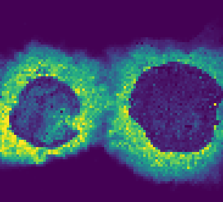

# Off-sample Ion Images Detection in Mass Spectrometry Imaging Data

This repository contains research and experimental results for the project aimed at using
latest advances in Deep Learning for Computer Vision to detect with high accuracy off-sample images in
mass spectrometry imaging data.  

The results presented in this repository have been used to implement new features for
the Project [Metaspace](https://metaspace2020.eu) with purpose to help its users
to automatically filter out molecular search results that represent the area outside
of the biological sample.

The model is used in Metaspace as a service with simple API. 
The details of the model inference service can be found [Here](https://github.com/metaspace2020/metaspace/tree/master/metaspace/off-sample)

Examples of **on-sample** ion images:

<p float="left">
    
    
    
</p>

Examples of **off-sample**  ion images:

<p float="left">
    
    
    
</p>

# Results

A preprint of the paper describing the methods developed in the repository as well as other methods can be found on bioRxiv:

Katja Ovchinnikova, Vitaly Kovalev, Lachlan Stuart, Theodore Alexandrov [Recognizing off-sample mass spectrometry images with machine and deep learning](https://www.biorxiv.org/content/10.1101/518977v1.full)
 
Final model performance estimated by 5 fold group cross validation:

| Class | F1    | Precision | Recall | Accuracy |
| ------|:-----:|:---------:|:------:|:--------:|
| off   | 0.988 |   0.986   | 0.990  |  0.990   |
| on    | 0.992 |   0.993   | 0.990  |  0.990   |

# Getting Data

The dataset used for model training can be downloaded from S3

```bash
wget https://s3-eu-west-1.amazonaws.com/sm-off-sample/GS.tar.gz
tar -xf GS.tar.gz
```

It includes 23238 manually tagged ion images, of them 13325 belong to the “off-sample” class and 9913 to the "on-sample” class.

# Requirements

* Ubuntu >= 14.04
* Conda >= 4.5.11
* fastai==1.0.34
* pytorch>=1.0
* Nvidia GPU for fast training

All dependencies can be installed using the provided conda environment files.


# Setup

* Clone repository
* Create conda environment

```
cd classification
conda env create -n fastai --file fastai-env.yml
conda activate fastai
```

* If Jupyter is already installed, add a new kernel

```
python -m ipykernel install --user --name fastai --display-name fastai
```

* Otherwise install Jupyter into the environment

```
conda install jupyter
```

